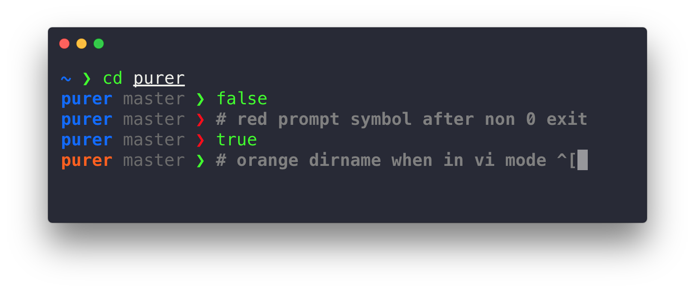

# Purest

> Pretty one-line ZSH prompt based on [@sindresorhus](https://github.)' [Pure](https://github.com/sindresorhus/pure) and [@DFurnes](https://github.)' [Purer](https://github.com/DFurnes/purer)



### Changes on top of Purer
* Tweaked colours
* More obvious colour change when in Vi mode
* Removed newline between commands
* Moved prompt symbol to end of prompt instead of beginning to make it more like `nicoulaj`

### Changes on top of Pure (from Purer)
* Vi Mode Indicator
* Single line prompt

## Install

#### Using [zplug](https://github.com/zplug/zplug):

```zsh
zplug "22a/purest"
```

For any installation methods beyond this or more detailed instructions, check out [Pure's readme](https://github.com/sindresorhus/pure/blob/master/readme.md#install).

## Customization

Purer supports customization using [Pure's environment variables](https://github.com/sindresorhus/pure#options), plus:

### `PURE_PROMPT_SYMBOL_COLOR`

Defines the prompt symbol color. The default value is `magenta`; you can use any [colour name](https://wiki.archlinux.org/index.php/Zsh#Colors) or [numeric colour code](https://upload.wikimedia.org/wikipedia/commons/1/15/Xterm_256color_chart.svg) (see `zshzle(1)` section [Character Highlighting](http://zsh.sourceforge.net/Doc/Release/Zsh-Line-Editor.html#Character-Highlighting).)

## License

Purest MIT © [Peter Meehan](http://22a.io) <br/>
Purer MIT © [David Furnes](http://dfurnes.com) <br/>
Pure MIT © [Sindre Sorhus](http://sindresorhus.com)
